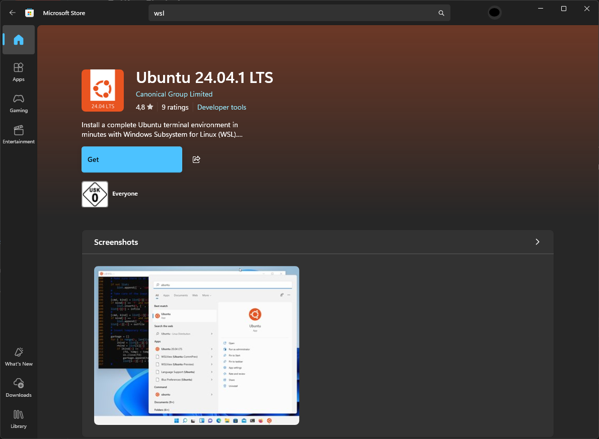
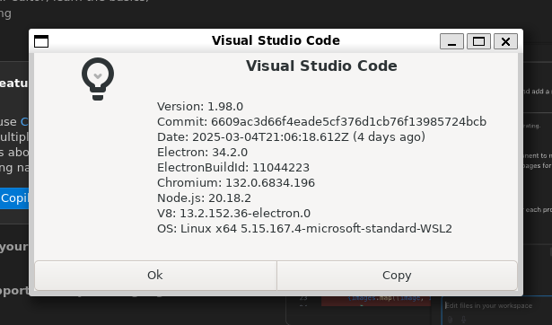
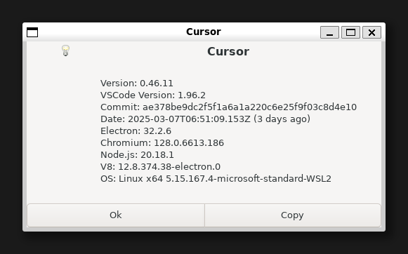
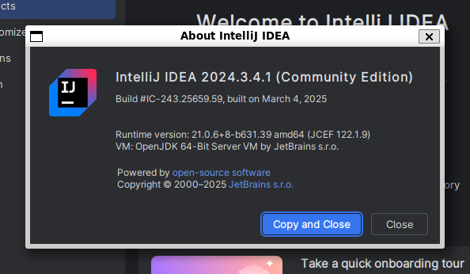

<!-- Improved compatibility of back to top link: See: https://github.com/othneildrew/Best-README-Template/pull/73 -->
<a id="readme-top"></a>
<!--
*** Thanks for checking out the Best-README-Template. If you have a suggestion
*** that would make this better, please fork the repo and create a pull request
*** or simply open an issue with the tag "enhancement".
*** Don't forget to give the project a star!
*** Thanks again! Now go create something AMAZING! :D
-->


<!-- PROJECT SHIELDS -->
<!--
*** I'm using markdown "reference style" links for readability.
*** Reference links are enclosed in brackets [ ] instead of parentheses ( ).
*** See the bottom of this document for the declaration of the reference variables
*** for contributors-url, forks-url, etc. This is an optional, concise syntax you may use.
*** https://www.markdownguide.org/basic-syntax/#reference-style-links
-->
[![Contributors][contributors-shield]][contributors-url]
[![Forks][forks-shield]][forks-url]
[![Stargazers][stars-shield]][stars-url]
[![Issues][issues-shield]][issues-url]
[![Unlicense License][license-shield]][license-url]
[![LinkedIn][linkedin-shield]][linkedin-url]


<!-- PROJECT LOGO -->
<br />
<div align="center">
  <!-- <a href="https://github.com/d-sch/wslg-dev-container">
    
  </a> -->

<h3 align="center">WSLg-dev-container</h3>

  <p align="center">
    Execute your favorite IDE (Cursor, Visual Studio Code, IntelliJ CE) inside a container and start developing.</br>
    Only needs WSL2-WSLg and a Docker installation. No further Windows dependencies.</br>
    Simply reinstall for upgrade.
    <br />
    <a href="https://github.com/d-sch/wslg-dev-container"><strong>Explore the docs »</strong></a>
    <br />
    <br />
    <!-- <a href="https://github.com/d-sch/wslg-dev-container">View Demo</a>
    &middot; -->
    <a href="https://github.com/d-sch/wslg-dev-container/issues/new?labels=bug&template=bug-report---.md">Report Bug</a>
    &middot;
    <a href="https://github.com/d-sch/wslg-dev-container/issues/new?labels=enhancement&template=feature-request---.md">Request Feature</a>
  </p>
</div>


<!-- TABLE OF CONTENTS -->
<details>
  <summary>Table of Contents</summary>
  <ol>
    <li>
      <a href="#about-the-project">About The Project</a>
      <ul>
        <li><a href="#built-with">Built With</a></li>
      </ul>
    </li>
    <li>
      <a href="#getting-started">Getting Started</a>
      <ul>
        <li><a href="#prerequisites">Prerequisites</a></li>
        <li><a href="#installation">Installation</a></li>
      </ul>
    </li>
    <li><a href="#usage">Usage</a></li>
    <li><a href="#roadmap">Roadmap</a></li>
    <li><a href="#contributing">Contributing</a></li>
    <li><a href="#license">License</a></li>
    <li><a href="#contact">Contact</a></li>
    <li><a href="#acknowledgments">Acknowledgments</a></li>
  </ol>
</details>


<!-- ABOUT THE PROJECT -->
## About The Project
Portable development environment. Easy.
<!-- [![Product Name Screen Shot][product-screenshot]](https://example.com) -->

<!-- Here's a blank template to get started. To avoid retyping too much info, do a search and replace with your text editor for the following: `d-sch`, `wslg-dev-container`, `twitter_handle`, `linkedin_username`, `email_client`, `email`, `project_title`, `project_description`, `project_license` -->

<p align="right">(<a href="#readme-top">back to top</a>)</p>


### Built With

* [![Docker][docker]][docker-url]
* [![GNU Bash][gnubash]][gnubash-url]
* [![cUrl][curl]][curl-url]

<p align="right">(<a href="#readme-top">back to top</a>)</p>


<!-- GETTING STARTED -->
## Getting Started

This is an example of how you may give instructions on setting up your project locally.
To get a local copy up and running follow these simple example steps.

### Prerequisites

- WSL\
    Example on how to install WSL and Ubuntu:

    Just install from the Microsoft Store
    

- Docker\
    Example on how to install Docker inside WSL2 Ubuntu:

    Open `Ubuntu` and execute following commands.
    ```bash
    $ sudo apt-get install ca-certificates curl
    $ sudo install -m 0755 -d /etc/apt/keyrings
    $ sudo curl -fsSL https://download.docker.com/linux/ubuntu/gpg -o /etc/apt/keyrings/docker.asc
    $ sudo chmod a+r /etc/apt/keyrings/docker.asc
    $ echo   "deb [arch=$(dpkg --print-architecture) signed-by=/etc/apt/keyrings/docker.asc] https://download.docker.com/linux/ubuntu \
        $(. /etc/os-release && echo "$VERSION_CODENAME") stable" |   sudo tee /etc/apt/sources.list.d/docker.list > /dev/null
    $ sudo apt-get update
    $ sudo apt-get install docker-ce docker-ce-cli containerd.io docker-buildx-plugin docker-compose-plugin
    ```
- Enable the Virtual Graphics Execution Manager
  1. Add this configuration file
      Command
        ```sh
        sudo nano /etc/modules-load.d/vgem.conf
        ```
      Content
        ```
        vgem
        ```
  2. Close all open WSL sessions
  3. Restart WSL
  - Press Windows+R and run `wsl --shutdown`
  
### Installation

1. Clone the repo
    ```sh
    git clone https://github.com/d-sch/wslg-dev-container.git
    ```
2. Install your IDE
    ```sh
    ./install-code.sh
    ```
    or
    ```sh
    ./install-cursor.sh
    ```
    or
    ```sh
    ./install-intellij.sh
    ```

<p align="right">(<a href="#readme-top">back to top</a>)</p>

<!-- USAGE EXAMPLES -->
## Usage

After your favorite IDE is installed you can start it with
```sh
./start.sh
```

Your IDE will welcome you after the container initialization is done.

### Enable Gpu Support

#### Prerequisites
- Make sure path of `XDG_RUNTIME_DIR`, `XDG_RUNTIME_DIR/dconf` and file `XDG_RUNTIME_DIR/dconf/user` is owned by your user. 
  - Create file according to https://github.com/microsoft/wslg/issues/1032#issuecomment-2458021984
      ```
      $ nano ~/.config/user-tmpfiles.d/wslg.conf
      ```
      Content
      ```
      #Type Path                                     Mode User Group Age         Argument
      L+    %t/wayland-0                             -    -    -     -           /mnt/wslg/runtime-dir/wayland-0
      L+    %t/wayland-0.lock                        -    -    -     -           /mnt/wslg/runtime-dir/wayland-0.lock
      L+    %t/pulse                                 -    -    -     -           /mnt/wslg/runtime-dir/pulse
      ```
  - ensure `systemd-tmpfiles-setup.service` is enabled
      ```sh
      sudo systemctl --global enable systemd-tmpfiles-setup.service
      ```
  - restart WSL in PowerShell or Command Prompt
      ```
      wsl --shutdown
      ```

#### NVidia 

- Make sure devcontainer is down
- First install the `cuda-toolkit`
  ```sh
  $ wget https://developer.download.nvidia.com/compute/cuda/repos/wsl-ubuntu/x86_64/cuda-wsl-ubuntu.pin 
  $ sudo mv cuda-wsl-ubuntu.pin /etc/apt/preferences.d/cuda-repository-pin-600
  $ wget https://developer.download.nvidia.com/compute/cuda/12.8.1/local_installers/cuda-repo-wsl-ubuntu-12-8-local_12.8.1-1_amd64.deb
  $ sudo dpkg -i cuda-repo-wsl-ubuntu-12-8-local_12.8.1-1_amd64.deb
  $ sudo cp /var/cuda-repo-wsl-ubuntu-12-8-local/cuda-*-keyring.gpg /usr/share/keyrings/
  $ sudo apt-get update
  $ sudo apt-get -y install cuda-toolkit-12-8
  ```
- Now install the `nvidia-container-toolkit`
  ```sh
  $ curl -fsSL https://nvidia.github.io/libnvidia-container/gpgkey | 
  sudo gpg --dearmor -o /usr/share/keyrings/nvidia-container-toolkit-keyring.gpg \
    && curl -s -L https://nvidia.github.io/libnvidia-container/stable/deb/nvidia-container-toolkit.list | \
      sed 's#deb https://#deb [signed-by=/usr/share/keyrings/nvidia-container-toolkit-keyring.gpg] https://#g' | \
      sudo tee /etc/apt/sources.list.d/nvidia-container-toolkit.list
  $ sudo sed -i -e '/experimental/ s/^#//g' /etc/apt/sources.list.d/nvidia-container-toolkit.list
  $ sudo apt-get update
  ```
- Un-commment gpu resources and save `docker-composer.yml`
  ```
      deploy:
        resources:
          reservations:
            devices:
              - capabilities: [gpu]
  ```
- Start devcontainer
  ```sh
  $ ./start.sh
  ```

##### Current Installation Instructions
- `cuda-toolkit`\
https://developer.nvidia.com/cuda-downloads?target_os=Linux&target_arch=x86_64&Distribution=WSL-Ubuntu&target_version=2.0&target_type=deb_local
- `nvidia-container-toolkit`\
https://docs.nvidia.com/datacenter/cloud-native/container-toolkit/latest/install-guide.html#installing-the-nvidia-container-toolkit

## Visual Studio Code


## Cursor


## IntelliJ


_For more examples, please refer to the [Documentation](https://example.com)_

<p align="right">(<a href="#readme-top">back to top</a>)</p>

<!-- ROADMAP -->
## Roadmap

Create `Development Containers` version that uses [`Development Containers CLI`](https://github.com/devcontainers/cli).
To provide a more streamlined experience.

See the [open issues](https://github.com/d-sch/wslg-dev-container/issues) for a full list of proposed features (and known issues).

<p align="right">(<a href="#readme-top">back to top</a>)</p>


<!-- CONTRIBUTING -->
## Contributing

Contributions are what make the open source community such an amazing place to learn, inspire, and create. Any contributions you make are **greatly appreciated**.

If you have a suggestion that would make this better, please fork the repo and create a pull request. You can also simply open an issue with the tag "enhancement".
Don't forget to give the project a star! Thanks again!

1. Fork the Project
2. Create your Feature Branch (`git checkout -b feature/AmazingFeature`)
3. Commit your Changes (`git commit -m 'Add some AmazingFeature'`)
4. Push to the Branch (`git push origin feature/AmazingFeature`)
5. Open a Pull Request

<p align="right">(<a href="#readme-top">back to top</a>)</p>

### Top contributors:

<a href="https://github.com/d-sch/wslg-dev-container/graphs/contributors">
  
</a>


<!-- LICENSE -->
## License

Distributed under the project_license. See `LICENSE.txt` for more information.

<p align="right">(<a href="#readme-top">back to top</a>)</p>


<!-- CONTACT -->
## Contact

<!-- Your Name - [@twitter_handle](https://twitter.com/twitter_handle) - email@email_client.com -->

Project Link: [https://github.com/d-sch/wslg-dev-container](https://github.com/d-sch/wslg-dev-container)

<p align="right">(<a href="#readme-top">back to top</a>)</p>


<!-- ACKNOWLEDGMENTS -->
## Acknowledgments

Thanks to:
* [Best-README-Template](https://github.com/othneildrew/Best-README-Template)
<!-- * []() -->


<p align="right">(<a href="#readme-top">back to top</a>)</p>


<!-- MARKDOWN LINKS & IMAGES -->
<!-- https://www.markdownguide.org/basic-syntax/#reference-style-links -->
[contributors-shield]: https://img.shields.io/github/contributors/d-sch/wslg-dev-container.svg?style=for-the-badge
[contributors-url]: https://github.com/d-sch/wslg-dev-container/graphs/contributors
[forks-shield]: https://img.shields.io/github/forks/d-sch/wslg-dev-container.svg?style=for-the-badge
[forks-url]: https://github.com/d-sch/wslg-dev-container/network/members
[stars-shield]: https://img.shields.io/github/stars/d-sch/wslg-dev-container.svg?style=for-the-badge
[stars-url]: https://github.com/d-sch/wslg-dev-container/stargazers
[issues-shield]: https://img.shields.io/github/issues/d-sch/wslg-dev-container.svg?style=for-the-badge
[issues-url]: https://github.com/d-sch/wslg-dev-container/issues
[license-shield]: https://img.shields.io/github/license/d-sch/wslg-dev-container.svg?style=for-the-badge
[license-url]: https://github.com/d-sch/wslg-dev-container/blob/master/LICENSE.txt
[linkedin-shield]: https://img.shields.io/badge/-LinkedIn-black.svg?style=for-the-badge&logo=linkedin&colorB=555
[linkedin-url]: https://linkedin.com/in/linkedin_username
[product-screenshot]: images/screenshot.png
[docker]: https://img.shields.io/badge/docker-000000?style=for-the-badge&logo=docker&logoColor=#5FA04E
[docker-url]: https://docker.com
[gnubash]: https://img.shields.io/badge/gnubash-000000?style=for-the-badge&logo=gnubash&logoColor=#4EAA25
[gnubash-url]: https://www.gnu.org/software/bash/
[curl]: https://img.shields.io/badge/curl-000000?style=for-the-badge&logo=gnubash&logoColor=##073551
[curl-url]: https://curl.se/